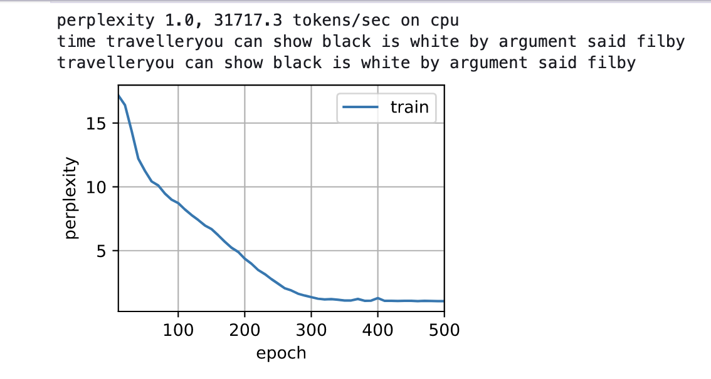
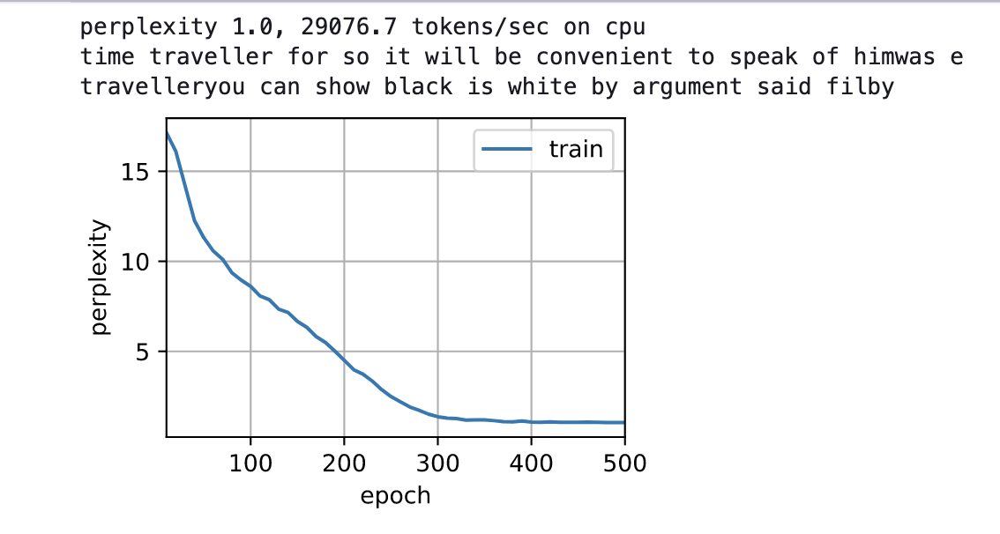
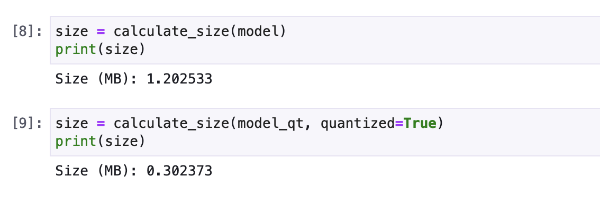

# Quantization-HPML

**Authors:** Harish Pal Chauhan, Vishnuram Hariharan

**Summary:** We created a quantized version of a LSTM (Language Model) model through *Quantization Aware Training* using python and pytorch. This quantized model is 25% of the original model in size and performs with same accuracy.

### Prerequisites
pip install -r requirements.txt

### Code execution 
Run main.ipynb notebook 

### Results

#### Quantized model is able to perform at the same level as original model 

#### Size of quantized model is reduced by 75%
 

